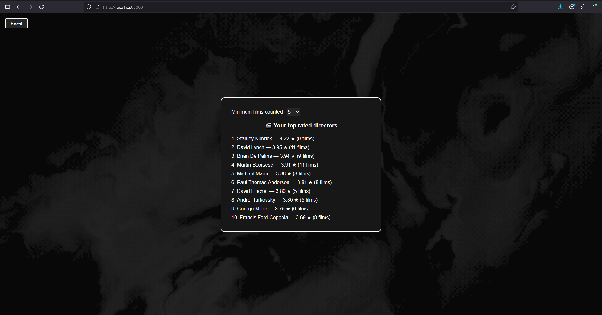

#Boxdstats

A fullstack personal project built with **Next.js 14**, **React**, **TypeScript**, and **Tailwind CSS**. Uses Node.js-based route handlers for the backend.

### Prerequisites

- Node.js v18.x
- npm
- Git

---

## Tech stack

| Front end | Back end |
|-----------|----------|
| Next 14 (App Router) / React / Tailwind CSS | Node 18 Route Handlers |

---

## Setup

```bash
# Open Git bash wherever you want
git clone https://github.com/aymenQQ/Boxdstats.git 
cd Boxdstats

npm install

# Create a file called *.env.local* where you will paste this "NEXT_PUBLIC_API_KEY=your_tmdb_api_key_here"
# Create an account on https://www.themoviedb.org/
# Go to Settings, API, get you API key and paste is in your *.env.local* to replace "your_tmdb_api_key_here" and save

npm run dev
# Open localhost:3000 on your browser
```

### Screenshots





